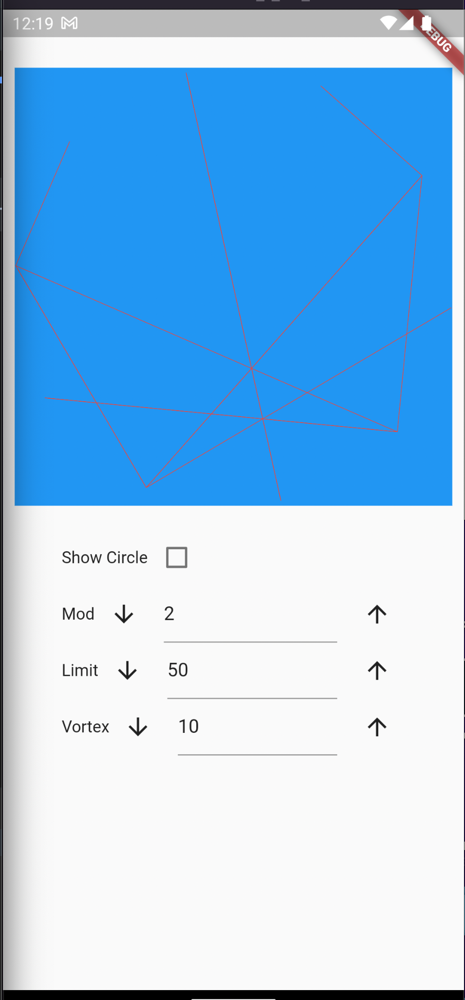
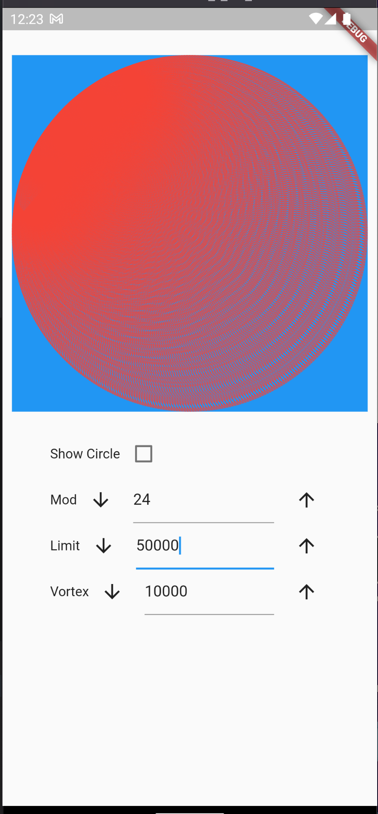
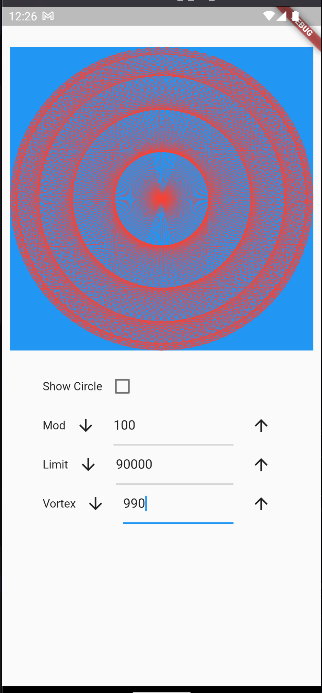
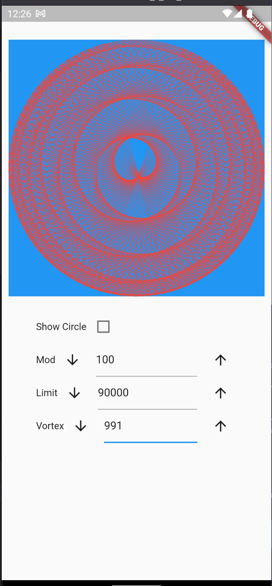
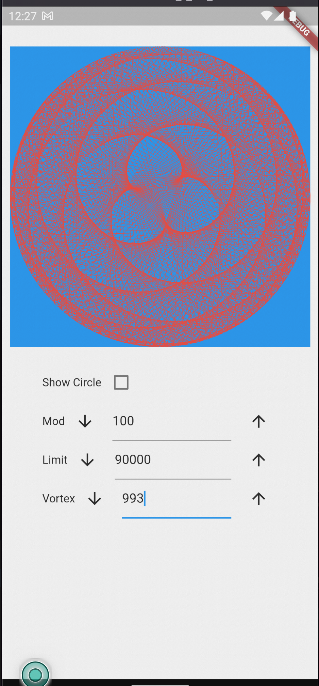

# circle_vortex

This is the project of circle vortex.
I am learning mathematics with programming. 
and trying to create different mathematical things with it. 

here, is the practice project for circle vortex where I have created different patterns with different limit, vortex and mods.

here,
mod is multiplier. 
limit is circle limit.
vortex is number of points in circle.

  
 

you can check demo videos to know how it works.

[demo 1](01.mov)
[demo 2](02.mov)
[demo 3](03.mov)

## I get inspiration to learn this thing by ["Mathologer"](https://www.youtube.com/watch?v=qhbuKbxJsk8). 